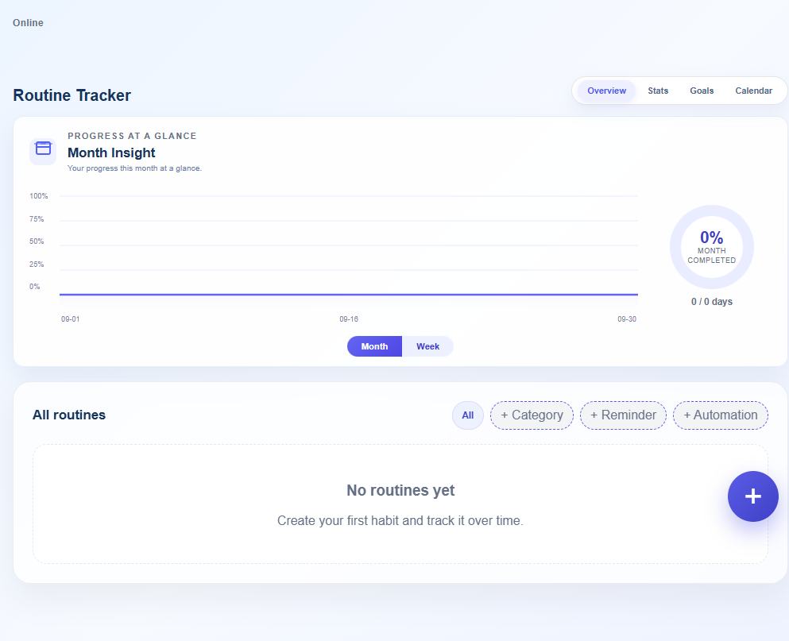
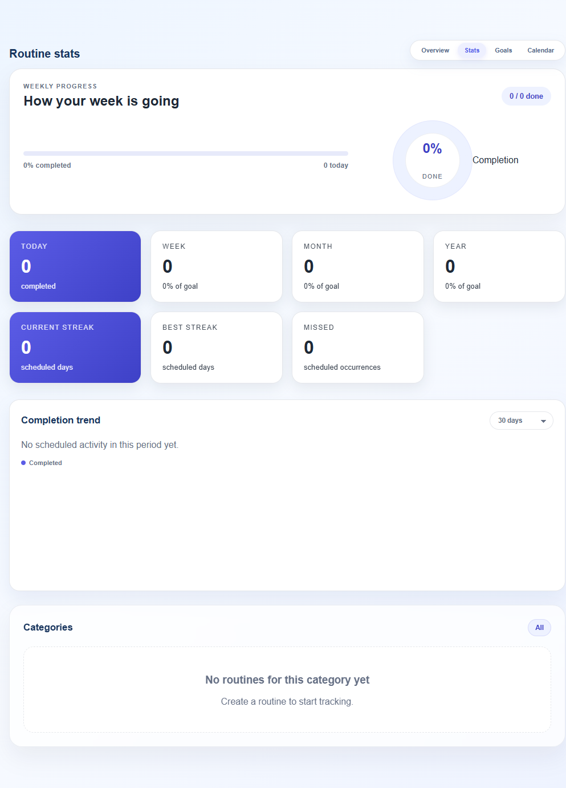
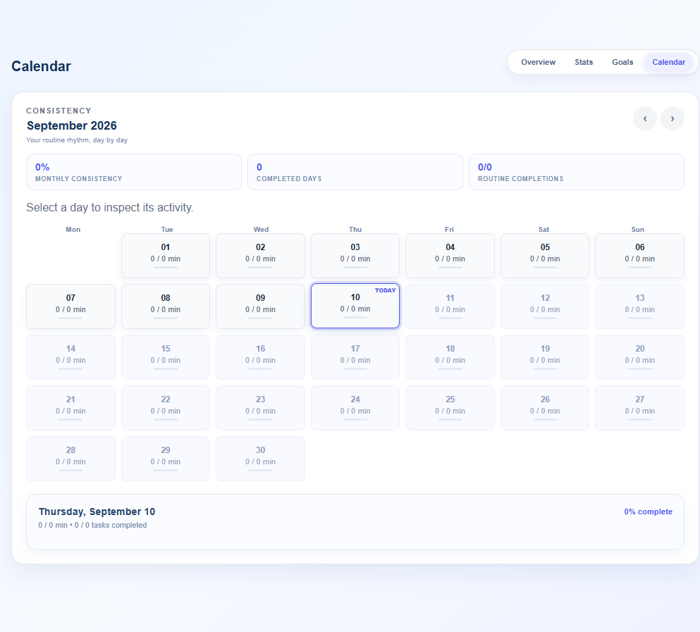

# Routine Tracker

Routine Tracker is a personal routine and progress-tracking web application built with Flask, SQLite, Jinja templates, and vanilla JavaScript.

It helps users organize routines and tasks, record completion, review progress over time, and manage related reminders, timers, goals, and notifications.

## About the project

Hi, my name is Godzilla.

If you're reading this, thank you.

This project started as an idea I had after seeing people selling simple Google Sheets habit-tracker templates. Originally, I wanted to take that idea, add login functionality, and turn it into a website that people could access publicly.

But after everything that happened, I decided to take it in a different direction: make it open source and self-hostable.

I wanted people to be able to run it on their own hardware — even an old laptop or a simple computer — without needing some powerful server or expensive service.

Most of this project was built with the help of AI, mainly ChatGPT and GitHub Copilot. I'm not going to pretend I wrote every line myself. AI played a huge part in helping me turn the idea into something real.

And honestly, I'm happy I did it. Building this has been a really good experience for me, and it was a lot of fun making something that I would actually use myself.

I hope you guys like it too. ❤️

## Screenshots

### Overview



### Statistics



### Calendar



## Features

- Routines with descriptions, categories, schedules, target minutes, pause/archive, and duplication support.
- Tasks assigned to routines, including task durations and completion history.
- Daily progress derived from scheduled task durations:
  - planned minutes
  - completed minutes
  - completion percentage
  - completed and total task counts
  - fully completed state
- Weekly progress aggregated from daily results.
- Monthly progress aggregated from daily results.
- Calendar view with month navigation, selected-day details, task counts, minutes, and completion state.
- Statistics and analytics views with month/week progress trends.
- History access through the Calendar view.
- Goals that can be linked to user-owned routines and calculated from routine completion history.
- Reminders with one-time, daily, or weekly recurrence, completion, dismissal, and snooze actions.
- Timers associated with routines or tasks.
- Categories, milestones, notification preferences, and account data management.
- PWA manifest and service worker support.
- Optional Web Push notifications.
- Password hashing, optional account/password operations, CSRF protection, and ownership checks for user-owned resources.
- Optional SMTP password-reset email support.
- Optional Stripe subscription and webhook support.

### Progress model

Progress follows one hierarchy:

```text
Tasks
  -> Daily progress
    -> Weekly aggregation
      -> Monthly aggregation
```

Daily progress is the source of truth for task-based tracking. Weekly and monthly values aggregate daily results, and Calendar displays daily progress.

A day is fully complete only when all required tasks scheduled for that day are complete. Weekly and monthly percentages are weighted by planned/completed minutes rather than averaging daily percentages.

## Requirements

- Python 3.14 was used for the current development environment. Other Python versions may work, but are not formally specified by the project.
- SQLite 3.
- A supported Python environment capable of installing [requirements.txt](requirements.txt).

Runtime dependencies are in [requirements.txt](requirements.txt). Development and test dependencies are in [requirements-dev.txt](requirements-dev.txt). Optional integration and production-server dependencies are in [requirements-integrations.txt](requirements-integrations.txt).

## Quick setup / installation

Clone the repository and enter the project directory:

```bash
git clone https://github.com/God-z1lla/Momentum.git
cd Momentum
```

Choose the installer for your operating system. Each installer:

- checks that Python 3 is available;
- creates a local `.venv` virtual environment;
- upgrades pip inside that environment; and
- installs the runtime packages from [requirements.txt](requirements.txt).

The scripts do not require administrator/root privileges because they install into the project directory. Windows PowerShell may require a temporary execution-policy change if local scripts are blocked; this change applies only to the current PowerShell session.

### Windows PowerShell

```powershell
.\install_windows.ps1
```

If PowerShell blocks local scripts for the current session:

```powershell
Set-ExecutionPolicy -Scope Process Bypass
.\install_windows.ps1
```

The Windows script uses `py -3` when available and otherwise uses `python`.

### Linux

```bash
chmod +x install_linux.sh
./install_linux.sh
```

The Linux script uses `python3` by default. To use a different Python 3 executable, set `PYTHON_BIN`, for example:

```bash
PYTHON_BIN=python3.12 ./install_linux.sh
```

### macOS

```bash
chmod +x install_macos.sh
./install_macos.sh
```

The macOS script also uses `python3` by default and supports the same `PYTHON_BIN` override:

```bash
PYTHON_BIN=python3.12 ./install_macos.sh
```

After installation, start the personal shared-profile mode with:

```bash
# Linux/macOS
.venv/bin/python run.py
```

```powershell
# Windows PowerShell
.\.venv\Scripts\python.exe run.py
```

Press Enter at the port prompt to use port `5000`.

### Manual installation

If you prefer not to use the installer scripts, create and activate a virtual environment yourself, then install the runtime dependencies:

```bash
python3 -m venv .venv
.venv/bin/python -m pip install --upgrade pip
.venv/bin/python -m pip install -r requirements.txt
```

On Windows PowerShell:

```powershell
py -3 -m venv .venv
.\.venv\Scripts\python.exe -m pip install --upgrade pip
.\.venv\Scripts\python.exe -m pip install -r requirements.txt
```

For development and tests, install [requirements-dev.txt](requirements-dev.txt), which includes the runtime requirements and pytest:

```bash
.venv/bin/python -m pip install -r requirements-dev.txt
```

The optional [requirements-integrations.txt](requirements-integrations.txt) file contains packages for optional Web Push, Stripe, and Waitress integrations. Install it only if you intend to configure those features:

```bash
.venv/bin/python -m pip install -r requirements-integrations.txt
```

Copy [.env.example](.env.example) to `.env` only when you need custom configuration. The default shared self-hosted mode works without a login or external services.

## Configuration

Configuration examples are provided in [.env.example](.env.example). Never commit a real `.env` file.

### Production settings

For a production deployment, configure:

- `ROUTINE_TRACKER_ENV=production`
- `ROUTINE_TRACKER_SECRET` with a long, randomly generated secret of at least 32 characters.
- `ROUTINE_TRACKER_HTTPS=1` when the application is served through HTTPS.
- `ROUTINE_TRACKER_TRUST_PROXY=1` only when the proxy configuration is trusted and correctly controlled.
- `ROUTINE_TRACKER_DB` if the default SQLite path is not suitable.

### Authentication modes

The default self-hosted mode uses one persistent local profile and does not show a login page:

- `ROUTINE_TRACKER_AUTH=shared` (default) uses the local shared profile.
- `ROUTINE_TRACKER_AUTH=accounts` enables email/password registration, login, logout, password reset, and per-user data isolation for a corporate or multi-user deployment.

No Google or OAuth login is included.

### Local and development settings

- `FLASK_DEBUG=1` enables Flask debug mode and should not be used for public deployment.
- `ROUTINE_TRACKER_LOCAL=1` is retained for the local launcher and forces the shared profile.

### Optional integrations

#### SMTP password reset email

Configure these variables when using password-reset email:

- `SMTP_HOST`
- `SMTP_PORT`
- `SMTP_USERNAME`
- `SMTP_PASSWORD`
- `SMTP_SENDER`
- `SMTP_USE_TLS`

A real SMTP account is required before email delivery can work.

#### Stripe billing

Stripe support is optional and requires:

- `STRIPE_SECRET_KEY`
- `STRIPE_WEBHOOK_SECRET`
- `STRIPE_MONTHLY_PRICE_ID`
- `STRIPE_YEARLY_PRICE_ID`
- `STRIPE_SUCCESS_URL`
- `STRIPE_CANCEL_URL`

#### Web Push

Web Push requires:

- `VAPID_PUBLIC_KEY`
- `VAPID_PRIVATE_KEY`
- `VAPID_SUBJECT`

Browsers generally require HTTPS for Web Push outside localhost.

## Running

### Personal self-hosted mode

This is the default single-profile mode. It has no login page and initializes the database automatically:

```bash
.venv/bin/python run.py
```

On Windows:

```powershell
.\.venv\Scripts\python.exe run.py
```

Press Enter at the port prompt to use port 5000. The development server is not intended for public internet deployment.

### Corporate / multi-user mode

Use this launcher when each person needs a separate local email/password account:

```bash
.venv/bin/python run_corporate.py
```

On Windows:

```powershell
.\.venv\Scripts\python.exe run_corporate.py
```

This enables `ROUTINE_TRACKER_AUTH=accounts`, listens on the network by default, and requires users to register and sign in. It does not use Google or OAuth.

### Production

The project includes a WSGI entry point in [wsgi.py](wsgi.py). The existing deployment documentation uses Waitress:

```powershell
python -m waitress --listen=127.0.0.1:8000 wsgi:application
```

Install the runtime and production-server dependencies with `python -m pip install -r requirements.txt -r requirements-integrations.txt`. Do not expose Flask's development server directly to the public internet.

For production, use a persistent database path, a strong secret, HTTPS, and an appropriately configured reverse proxy or host firewall.

## Self-hosting and LAN access

The application can be hosted on a computer or home server and accessed by another device on the same local network.

Configure the server to listen on the desired interface, allow the application port through the host firewall, and browse to the host's LAN address. For example:

```text
http://192.168.1.50:3000
```

This is only an example; the address and port depend on the server configuration. The default development launcher uses port `5000`, while the production example above uses Waitress on port `8000`.

This repository does not currently provide Docker support. Internet-facing deployment requires additional infrastructure and careful HTTPS, proxy, firewall, backup, and authentication configuration.

## Database and migrations

Routine Tracker uses SQLite. The application creates the configured database directory and runs schema initialization/migrations during startup.

Schema migrations are versioned and recorded in the `schema_migrations` table with checksums. Allow initialization to finish before using the application after an upgrade.

Back up the SQLite database before deployments or upgrades. Database files contain application and user data and must not be committed to source control. SQLite runtime files such as `-wal` and `-shm` files are local database state and should also remain outside Git.

See [PRODUCTION.md](PRODUCTION.md) for additional deployment and backup guidance.

## Security

- Passwords are stored using salted PBKDF2-SHA256 hashes.
- CSRF protection is applied to state-changing requests in accounts mode.
- User-owned routine, task, goal, reminder, timer, and related resources are checked for ownership.
- Production requires a strong `ROUTINE_TRACKER_SECRET`.
- Keep `.env` files, database files, backups, and credentials out of Git.
- Shared mode is intended for a trusted self-hosted installation. Use accounts mode for a corporate or multi-user deployment.

Shared mode uses a persistent local profile without a login page. Set `ROUTINE_TRACKER_AUTH=accounts` to require email/password registration and login; in that mode, protected browser pages redirect unauthenticated users to `/login`, while protected API requests return HTTP 401. Password reset remains optional and requires SMTP configuration.

## Testing

Install the project dependencies, activate the virtual environment, and run:

```bash
python -m pytest -q
```

The current repository test suite passes with 44 tests. Tests use isolated temporary SQLite databases and explicitly establish authenticated test state where required.

## Project structure

```text
app.py                 Flask application, routes, database setup, and migrations
run.py                 Personal shared-profile launcher
run_corporate.py       Corporate multi-user launcher
wsgi.py                WSGI entry point
worker.py              Optional Web Push/reminder delivery worker
templates/             Jinja HTML templates
static/                CSS, JavaScript, PWA manifest, and service worker
screenshots/           Example application screenshots
tests/                 Pytest test suite
database/              Runtime SQLite database location
requirements.txt       Runtime dependencies
requirements-dev.txt   Development and test dependencies
requirements-integrations.txt Optional integration and production-server dependencies
.env.example           Safe configuration template
PRODUCTION.md          Production and backup notes
```

## Optional integrations

Optional integrations are disabled until their environment variables and external services are configured:

- SMTP for password-reset email.
- Stripe for subscription checkout, cancellation, and webhooks.
- Web Push for browser notifications.
- The reminder worker for scheduled push delivery.

Google OAuth is not part of the application.

## Current status

Routine Tracker is actively developed and being prepared for public self-hosting. Core routine, task, daily/weekly/monthly progress, Calendar, goals, reminders, timers, and analytics functionality is implemented and covered by the current test suite.

The project should be treated as a self-hosted/development application until deployment-specific authentication, HTTPS, proxy, backup, monitoring, and operational configuration have been reviewed for the target environment.

## License

License: AGPL-3.0 is planned for the public release.
